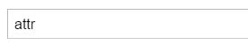
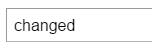

# 举例来讲
### 我们现在有一个input#demo
```html
<input id="demo" value="attr">
```
***
#### - Attribute和Property都被翻译成“属性”
#### - "value"就是input#demo的属性之一
#### - 也就是说，没错，就像你想的一样
#### - input#demo的 Attribute "value"值为"attr"
#### - input#demo的 Property "value"值同为"attr"
***

### 这时候你可能会问了：**什么时候他们不一样？**
***

<!-- more -->
#### **wendehao！**
> #### 当我们使用如下js代码对input#demo进行操作后
>```js
>document.getElementbyId('demo').value='changed';
>```
#### 此时打开你浏览器的F12（Chrome的Devtool，FireFox的Firebug等等）
>#### 你会发现:
>##### 修改前是这样的
>
>##### 修改后是这样的
>

## ??????????????你在逗我呢吧
#### 慌 不要慌 且看页面
>##### 修改前是这样的
>
>##### 修改后是这样的
>

***
### 没错 聪明的你可能已经想到了
###  **```.value = 'changed'```只修改了Attr与Prop之中的一个**
***
## ```.value```方法修改的是input#demo的Property
>#### 而当我们使用如下js代码时
>```js
>document.getElementbyId('demo').setAttribute('value','changed');
>```
### 此时你会发现更诡异的事情是
>#### 页面的值并没有发生改变
>
>#### 但是打开你的F12，你会发现value值发生了变化
>

### 得出结论
## ```.setAttribute()```方法修改的是input#demo的Attribute
***
在这里引用一段 -T大大- 博客里的文字来更好的阐述这两者的区别

原文链接：http://blog.csdn.net/wangji5850/article/details/50925042 //图片请前往原文查看
>此问题归根结底是由于DOM的property和attribute的区别：

>### attribute
>
> input节点有很多属性(attribute)：‘type’,’id’,’value’,’class’以及自定义属性，在DOM中有setAttribute()和getAttribute()读写DOM树节点的属性(attribute)
>
> PS:在这里的getAttribute方法有一个潜规则，部分属性（input的value和checked）通过getAttribut取到的是初始值，这个就很好的解释了图2结果为什么为2。
>
> ### property
>
> JavaScript获取到的DOM节点对象，比如input
> 你可以将他看作为一个基本的js对象，这个对象包括很多属性(property)，比如“value”，“className”以及一些方法，setAttribute,getAttribute,onclick等，值得注意的是对象的value的属性(property)取值是跟着输入框内的当前值一起更新的，这解释了图1中7为什么为200了。
> 所有在日常的工作中，推荐是使用 property,这样事情处理起来比较简单一些，attribute永远是字符串。。

---
