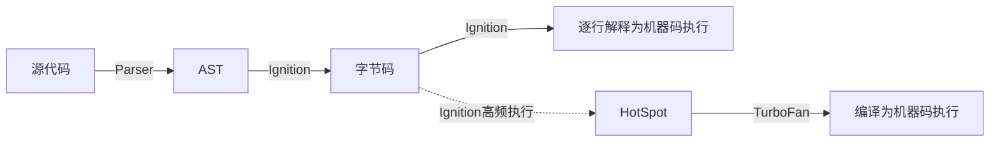

## 0. V8介绍
官方文档这么介绍：V8是谷歌开源高性能JavaScript和WebAssembly引擎，用C++编写。它主要用在Chrome和Node.js中，等等。

简单的来说，我们知道，JavaScript是解释型的语言，需要逐行解释执行

V8则是一种C++开发的JavaScript解释器，它将JavaScript编译成可执行代码，即机器码。

## 1. V8工作流程概述
JavaScript是解释型的语言，解释型的语言先天就有执行效率上的不足。为此，V8引擎同时采用了解释执行和编译执行这两种方式，也就是在解释执行的同时进行编译，这种方式称为**JIT (Just in Time) 即时编译**。

**解释执行**：V8在执行JavaScript源码时，会先通过解析器Parser将源码解析成AST，解释器Ignition会将AST转化为字节码，一边解释一遍执行。

**即时编译**：Ignition同时会记录某一代码片段的执行次数，如果执行次数超过了某个阈值，这段代码便会被标记为热点代码(HotSpot)，同时将运行信息反馈给**优化编译器TurboFan**，会将这部分热点代码的字节码优化并编译，生成机器码更高效地运行。



### 1.1 Parser 解析器 生成语法抽象树（AST）
生成AST中的一个优化是惰性解析(Lazy Parsing)，因为源码在执行前如果全部完全解析的话，不仅执行时间过长，而且会消耗更多的内存。
惰性解析就是指如果遇到并不是立即执行的函数，只会对其进行预解析(Pre-Parser)，当函数被调用时，才会对其完全解析。
预解析时，只会验证函数的语法是否有效、解析函数声明以及确定函数作用域，并不会生成AST，这项工作由Pre-Parser预解析器完成。

### 1.2 Ignition 解释器 生成字节码及解释执行

Ignition 是 V8 的解释器，负责生成和执行字节码。字节码与平台无关，也就是说无论 X86 架构或 ARM 架构，同一份 JavaScript 源码生成的字节码序列是相同的，解释器逐条读取字节码并执行。

字节码是机器码的抽象，可以看作是小型的构建块。相比机器码，字节码不仅占用内存少，而且生成字节码的时间很快，提升了启动速度。

### 1.3 Turbofan 优化编译器 对部分代码直接编译执行
Turbofan 是 V8 的优化编译器，它使 JavaScript 执行的更快，但比Ignition需要更多的编译时间，所以 V8 只对热点代码（HotCode）使用 Turbofan。

JavaScript 代码先由 Ignition 执行，并判断当该代码片段执行次数达到设定值时变为热点代码，由TurboFan把它编译为更高效的机器码储存起来，等到下次再执行到这段代码时，就会用现在的机器码替换原来的字节码进行执行，这样大大提升了代码的执行效率。


## 2.  V8工作流程中一些具体实现
### 2.1 隐藏类  JavaScript 动态类型
我们知道，JavaScript是动态类型语言，运行时数据类型会发生变化。V8 采用 C++ 编写，C++ 是强类型语言，要求类型确定。类型确定的 C++ 是如何表达类型不确定的 JavaScript 呢？

答案是：C++ 申请一块内存，这块是 JavaScript 的一个对象，并约定这块内存的开始位置保存内存的解读方式，操作这块内存之前先查解读方法，通过改变解读方式来模拟 JavaScript 对象的动态变化。

具体来说：操作 JS 数据前先查询类型，再操作。为此，V8采用了隐藏类（Hidden Class），因为 JavaScript 程序员看不到这个 class，所以称为隐藏类。注意： 隐藏类的术语是 Map，它的含义是地图，说明如何解读内存，不是 JavaScript Map 机制。

V8通过查询存储空间的第一个位置，就可以找到Map。这个Map大小是80byte，存储信息的格式与位置也是固定的，存储信息包括：JavaScript 对象的存储空间有哪些成员，成员类型，成员偏移地址等。所以说，Map 就是地图。


### 2.2 Inline Cache 内联缓存

我们已经知道，V8在查找对象的属性（例如obj.x）时流程是这样的：查找对象 obj 的隐藏类，再通过隐藏类查找 x 属性偏移量，然后根据偏移量获取属性值。

我们把上面这个获取 x 属性偏移量的过程称为寻址方法。

简单的来说：IC负责缓存对象的寻址方法，下次执行该函数时，直接使用寻址方法（V8 中的术语是 Handler），节省了计算寻址方法的时间。


## 3. 如何编写优化的 JavaScript
### 3.1 隐藏类
我们已经知道，V8 通过查询 Map，可以知道存储空间内存放了什么，怎么存放的，进而正确操作该对象。

例如有以下代码：

```javascript
function Point(x,y) { 
    this.x = x; 
    this.y = y; 
} 
const obj = new Point(1,2);
```

一旦声明了一个新的方法实例，Javascript就会创建一个隐藏类C0。


在此时还没有声明任何的属性，所以C0现在为空。
一旦第一个语句“this.x=x”被执行，V8将会基于C0创建第二个隐藏类C1。C1记录了可以找到属性x在内存中的位置。

在这个例子中，x保存在偏移量为0的位置，这表示可以将一个内存中的对象目标看作是一段连续的空间。而这段空间中的第一段偏移代表着属性x。与此同时，V8将会用“类偏移”操作更新C0，这代表着属性x已经添加到了目标对象。之后，目标对象所对应的隐藏类指针将指向C1。


每当目标对象添加一个新的属性，对象的旧的隐藏类就会变换路径到一个新的隐藏类。隐藏类的重要之处在于可以使经过相同创建过程创建的对象共享隐藏类。假如两个对象共享一个隐藏类，并向两个对象中同时添加相同的属性，那么这种变换将会保证变换后得到相同的隐藏类，这样代码就得到了优化。
当“this.y=y”执行时将重复上面的操作。一个新的叫C2的隐藏类将被创建，然后对C1进行类变换表明属性y已经添加到了目标对象，最后将隐藏类指向C2。这样目标对象的隐藏类就更新到了C2。


注意：隐藏类的变换取决于对目标对象的属性添加顺序。请注意下面的代码：

```javascript 
function Point(x,y) { 
    this.x = x; 
    this.y = y;
} 
var obj1 = new Point(1,2);
var obj2 = new Point(3,4);
// 至此为止 obj1和obj2都共享同一个隐藏类
obj1.a = 5; 
obj1.b = 10; 
obj2.b = 10; 
obj2.a = 5;
```


直到第6行为止，obj1和obj2都共享同一个隐藏类。但是，当属性a和b以相反的顺序添加到了两个对象中，这导致最后两个对象以不同的变换路径产生了两个不同的的隐藏类。


**因此，隐藏类更希望开发者不要频繁添加对象的属性，更希望对象的属性实例化顺序是固定的。像上述的例子，希望你只按照相同的顺序添加属性，先添加a，后添加b，这样obj1与obj2就可以共享同一个隐藏类。如果经常毫无规律的变动对象的内部成员，就会保存越来越多的隐藏类，带来不必要的性能开销。**

### 3.2 Inline Cache

inline cache 提升了 JavaScript 的运行性能，但对于使用次数较少的 JavaScript 函数使用 inline cache 不会带来太多的性能，反而影响 V8 的性能。因此 V8 规定，函数调用次数超过 8 次时才开启 inline cache。
例如有以下函数：

```javascript
function getfoo(obj){
 return obj.foo;
}
const o1 = {"x":42,"y":43,"foo","41"};
for(let i=0;i<10;i++){
 getfoo(o1);
}
```

运行getfoo时，V8会先读取obj的Map，找到foo的偏移量，然后才能获取foo。 当运行超过8次时，obj.foo的寻址方法会被缓存。

**所以inline cache更希望开发者不要变动o1的结构，更希望开发者对 o1 的读写操作是固定的。具体在本例中，希望你只对 foo 操作，inline cache 只需保存属性 foo 的寻址方式即可，如果经常变动o1的内部成员，inline cache就会保存越来越多的寻址方法，并且增加很多不必要的判断过程。影响性能。**

### 3.3 TurboFan

TurboFan将字节码编译为机器码并存储起来执行，来使得JavaScript运行的更快，但相比解释执行也需要更多的首次编译时间，这也是为什么V8只针对热点代码使用TurboFan。

TurboFan不希望程序的行为发生变化，例如我们有以下代码：
```javascript
function add(x,y){
    return x+y;
}
console.log(add(1, 2));
console.log(add("hello ", "world"));
```
我们知道 add() 是多态的，可以传入多种类型的参数。但是灵活也就意味着效率不高，需要判断类型，越界检测等等...

Turbofan 针对 add(1,2) 优化时，它笃定你的 add() 只用于整数加法运行，把其编译为本地机器码的加法运算，去掉了各种不必要的判断。针对 add("hello ","world") 优化时，TurboFan会把其编译为字符串的拼接操作。add() 的多态方便了开发者，减少了代码量，**但如果 add() 毫无规律地在不同操作数之间使用，会导致TurboFan编译更多的时间，存储更多的机器码，优化效果很差，所以 Turbofan 不希望程序行为变化。**


## 优化建议

1. 对象属性： 以相同顺序实例化对象的成员，以便于共享隐藏类。
2. 对象结构： 不要变动对象的结构，减少寻址方法内联缓存造成的额外开销。
3. 无规律的程序行为：减少无规律的程序行为，例如随意的多态调用，减少turbofan编译和存储机器码的额外开销。
4. 可复用的方法：方法尽量复用，提高使用频次，增加热点代码，使turbofan能够介入进行编译运行，提高程序运行效率


---
## 参考内容：
1. [《Chrome V8 源码》55. 优化技术综述，如何提升 JS 运行速度](https://zhuanlan.zhihu.com/p/514716577)
2. [How JavaScript works: inside the V8 engine + 5 tips on how to write optimized code](https://blog.sessionstack.com/how-javascript-works-inside-the-v8-engine-5-tips-on-how-to-write-optimized-code-ac089e62b12e)
3. [V8中的隐藏类（Hidden Classes）和内联缓存（Inline Caching）](https://zhuanlan.zhihu.com/p/469962133)
4. [浅析V8引擎，让你更懂JavaScript！](https://zhuanlan.zhihu.com/p/491369553)


以上！まいど～

---


