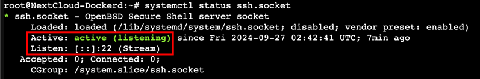

## 问题表现
更改`/etc/ssh/sshd_config`的端口号之后，发现`systemctl enable ssh`无效，开机后ssh服务不会自动启动，且ssh也连不上
## 问题原因
ssh默认以socket-activated方式启动而不是传统的service方式
## 什么是socket-activated
Socket Activation是systemd一种提供的系统服务管理方式。它允许系统在实际需要时启动服务，从而节省资源和提高启动速度。

也就是说，在ssh以socket-activated启动的情况下，当有客户端尝试连接 SSH 的端口（默认为 22）时，systemd 会监听这个端口并激活相应的 SSH 服务。

而socket所监听的接口并不会读取`/etc/ssh/sshd_config`而是存储在ssh.socket当中，所以当我们修改了`/etc/ssh/sshd_config`中的端口号之后，就无法触发ssh.socket了
## 验证&排查
1. 检查ssh是否为socket-activated方式启动
```shell
systemctl status ssh.socket 
```

> 如图所示，状态为active，说明当前的ssh是socket-activated方式启动，且正在监听22接口
> 
> 解决方式有两种，一种是修改ssh.socket所监听的端口号，另一种是恢复传统的service方式启动，这里我们选择第二种

2. 关闭ssh.socket
```shell
systemctl disable ssh.socket 
```
3. 启用ssh.service
```shell
systemctl enable ssh.service 
```
4. 重启解决
```shell
reboot
```
