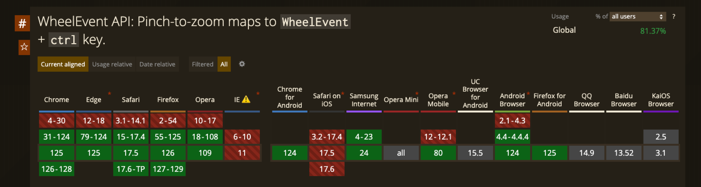

## 前情提要
**鼠标滚轮滚动/触控板双指缩放**都会触发`wheel`事件，在滚轮不需要触发缩放的场景下，需要对两种事件进行区分。

## TL;DR
**双指缩放事件会被映射为按下ctrl键的wheel事件**

即：由触控板缩放触发的`wheel`事件，`ev.ctrlKey`的值会为`true`，所以可以按照下面的代码进行区分：
```javascript
$target.addEventListener('wheel', (ev) => {
  const isTrackpadPinch = ev.ctrlKey 
  if(isTrackpadPinch){
    console.log('trackpad pinch')
  }
  else{
    console.log('mousewheel')
  }
})
```

## 浏览器支持


## 注意
需要注意的是， **Pinch-to-zoom maps to WheelEvent + ctrl key** 行为并没有在W3C标准中进行规定，应当是公认的实现。

## 参考来源
- [W3C关于WheelEvent的实现标准](https://www.w3.org/TR/uievents/#events-wheelevents)
- [CanIUse中关于Pinch-to-zoom maps to WheelEvent + ctrl key行为的兼容性描述](https://caniuse.com/mdn-api_wheelevent_pinch_to_zoom_support)
- [How to capture pinch-zoom gestures from the trackpad in a desktop browser (and prevent default)?](https://stackoverflow.com/questions/68808218/how-to-capture-pinch-zoom-gestures-from-the-trackpad-in-a-desktop-browser-and-p)
- [Pinch and wheel difference across browsers](https://github.com/pmndrs/use-gesture/discussions/518)

