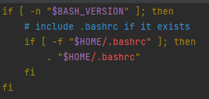

## 问题表现
添加```~/.bash_profile```之后，bash失去高亮，```~/.bashrc```中的逻辑不运行。

添加前↑

添加后↑
<!-- more -->
## 问题原因
在添加```~/.bash_profile```之后，```~/.profile```会被覆盖不再运行，而load bashrc的逻辑在```~/.profile```中，导致```~/.bashrc```也一并失效。

```~/.profile```中加载```~/.bashrc```的逻辑↑

## 解决方案
- 方案一：将```~/.bash_profile```中的逻辑移至```~/.profile```，并删除```~/.bash_profile```。
- 方案二：在```~/.bash_profile```中添加以下代码保证```~/.profile```中的代码运行。
 ```bash
 source ~/.profile
 ```


<br>
以上！まいど～

---------
