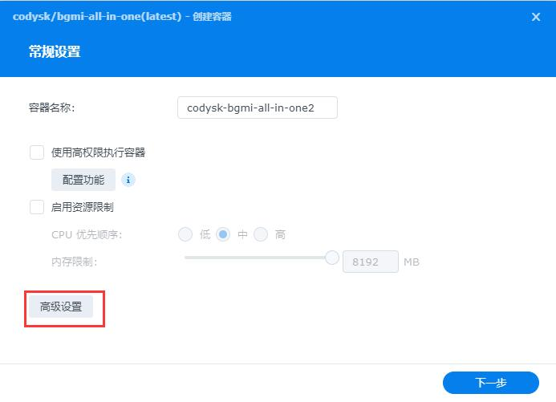
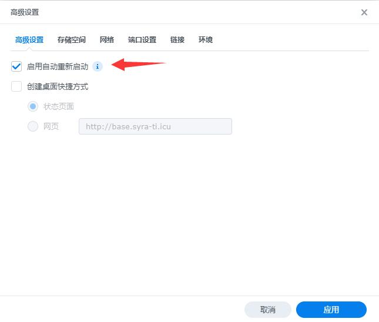
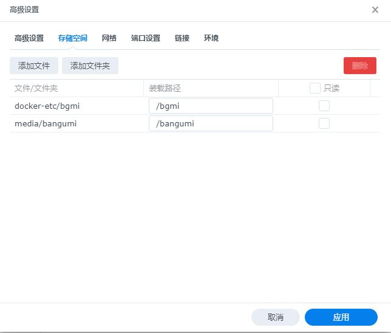
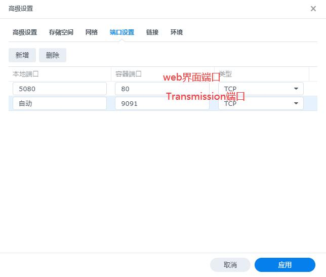
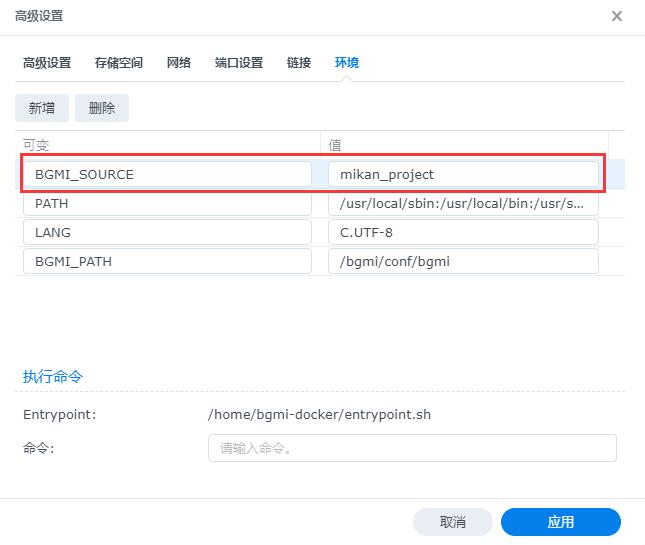
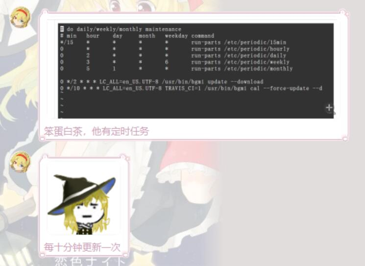
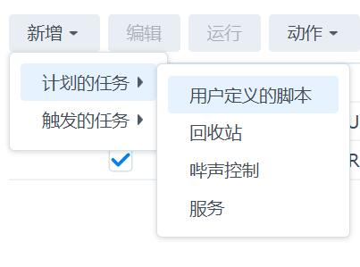
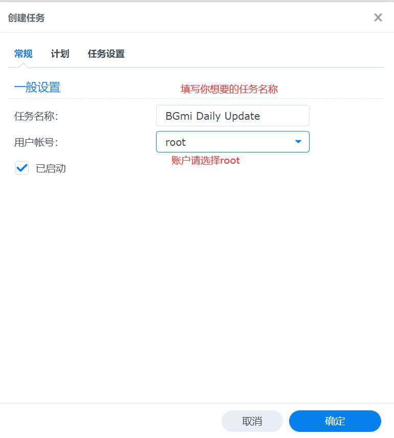
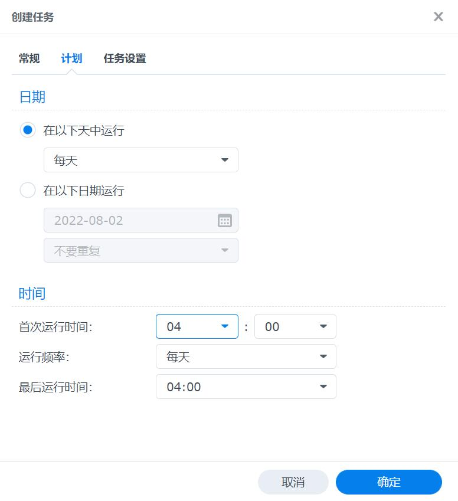
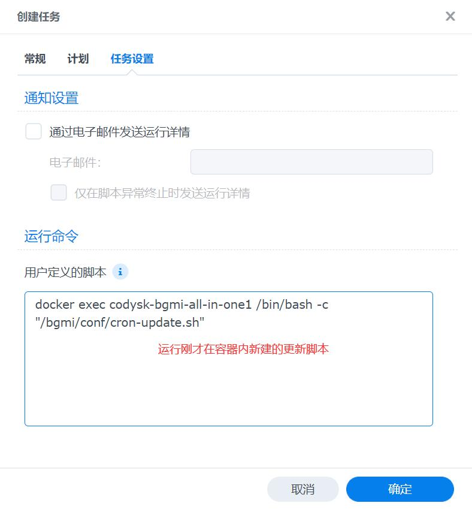

## 前情提要
已经在群晖部署了Emby+Aria2，但是番剧一直是手动下载，比较麻烦。想着能不能订阅自动下载之类的，翻了一遍Github看到了[BGmi](https://github.com/BGmi/BGmi)这个仓库，尝试下来体验还算不错。

## 部署
由于是在群晖部署，自然能用docker就用docker，BGmi也贴心提供了[docker镜像](https://github.com/BGmi/bgmi-docker-all-in-one)。镜像除了BGmi本体之外，还包含了一个Transmission，如果没有安装Aria2的姥爷们，也可以直接使用Transmission。 

ok，那么下面开始正式部署：
<!-- more -->
1. 打开群晖的```docker-注册表```，搜索```codysk/bgmi-all-in-one```，下载并启动。
   
   
2. 选择高级设置，进行相关配置
   
3. 配置应用开机自启
   
4. 配置文件映射，这里有两个文件夹需要映射，
   - 首先是```/bgmi```这是所有数据文件以及配置文件所在的地方，映射到群晖方便管理。
   - 其次是将Emby的资源文件夹映射到docker内，**需要注意的是，由于BGmi的配置项中下载路径只有一个，所以这里的路径要与Aria访问的路径保持一致。**
   
5. 配置端口映射，这里也有两个端口需要映射：
   - 80端口：这是BGmi的web管理界面端口，可以映射到自己想要的端口上去。
   - 9091端口：这是内置的Transmission端口，这里我们用Aria2，所以可以自动，也可以干脆删除。
   
6. 配置环境变量，添加一项环境变量```BGMI_SOURCE```，代表默认的数据源类型，这里可以填写```bangumi_moe/mikan_project/dmhy```，我们使用蜜柑计划作为我们默认的数据源。
   
完成docker配置之后，就可以一路启动啦！

## BGmi配置
部署完成后，进入到docker的bash，进行BGmi的配置。
这里需要用到```bgmi config```命令，下面先来介绍一下用法：
```bash
bgmi config # 查看当前各项设置的默认值.
bgmi config KEY # 查看某项设置的默认值
bgmi config KEY value # 修改某项设置
# example:
bgmi config ARIA2_RPC_TOKEN 'token:xxxxx'
```
我们需要修改的配置项如下：
```bash
bgmi config SAVE_PATH "/bangumi" #下载路径，这个路径要确保Aria2能够访问到
bgmi config DOWNLOAD_DELEGATE "aria2-rpc" #设置下载工具
bgmi config ARIA2_RPC_URL "http://172.17.0.1:6800/rpc" #ARIA2 RPC URL，这里由于我们使用的是docker，所以填写宿主机ip 172.17.0.1，具体可以根据情况更改
bgmi config ARIA2_RPC_TOKEN "token:xxx" #这里填写Aria2的token，如果没有则留空，或者不做修改 
```

## 订阅
配置完成后，则可以开始进行番剧的订阅。 下面，我们以最近大火的《石蒜反冲》为例（乐
1. 先前往[蜜柑](https://mikanani.me)，得到番剧名称“莉可丽丝”
   
2. 订阅番剧，使用BGmi的命令行进行订阅：
   ```bash
   bgmi add "莉可丽丝" 
   # 这里可以跟多个参数同时订阅多部番剧，如：
   bgmi add "莉可丽丝" "鬼灭之刃" "Love Live! Superstar!!"
   # 要注意的是，此处订阅默认是从最新一集开始的，如果想要从头开始下载，需要加上 --episode 0
   bgmi add "莉可丽丝" --episode 0
   ```

## 筛选
由于一部番剧下有不同的字幕组/清晰度/语言，所以在下载前需要设置番剧的筛选规则。
```bash
bgmi list # 列出目前订阅的番剧
bgmi fetch "莉可丽丝"
# include和exclude会忽略大小写。`720p`和`720P`的效果是相同的
bgmi filter "莉可丽丝" --subtitle "喵萌奶茶屋" --include 1080P --exclude "繁体"
bgmi fetch "莉可丽丝"
```
你可以按照自己的喜好，直到```fetch```到的列表是你所想要的内容。

## 下载
运行下面的命令更新番剧列表并且下载番剧，如果一切顺利的话，下载任务就会发送到Aria2啦！ 前往```SAVE_PATH```查看吧！
```bash
bgmi update --download
```

## 定时任务
#### 2022.8.2：发现docker里自带了10分钟一次的crontab，群晖的定时任务似乎没有什么必要了（点点点



<details>
<summary>先前的内容，可以不用看</summary>

~~既然已经完全了解如何下载番剧，那我们自然可以用任务来让BGmi定时运行来自动下载订阅的番剧啦！~~
1. ~~进入docker创建更新脚本~~
```bash
# 进入docker容器
> docker exec -it codysk-bgmi-all-in-one1 /bin/bash
# 创建更新脚本
docker@codysk-bgmi-all-in-one1 < cd /bgmi/conf && touch cron-update.sh
docker@codysk-bgmi-all-in-one1 < vi cron-update.sh
# 脚本内容
---- cron-update.sh -----
#!/bin/sh
echo "subscribe list:"
bgmi list
bgmi update --download
---- cron-update.sh -----
# 更改文件权限
docker@b2a8cf4027e8 < chmod a+rwx ./cron-update.sh
# 退出docker容器
docker@b2a8cf4027e8 < exit
> exit
```
2. ~~建立定时任务~~ 
   - ~~打开群晖 **控制面板->任务计划**，选择 **新增->计划的任务->用户定义的脚本**~~
   
   - ~~配置任务~~
   
   
   - ~~填写执行脚本~~
    ```bash
      docker exec codysk-bgmi-all-in-one1 /bin/bash -c "/bgmi/conf/cron-update.sh"
    ```
    

~~ok！这样就可以每天自动下载番剧，而不用去关心字幕组什么时候更新啦！~~

</details>

## 参考链接
1. [BGmi](https://github.com/BGmi/BGmi)
2. [bgmi-docker-all-in-one](https://github.com/BGmi/bgmi-docker-all-in-one)


以上！まいど～

---


